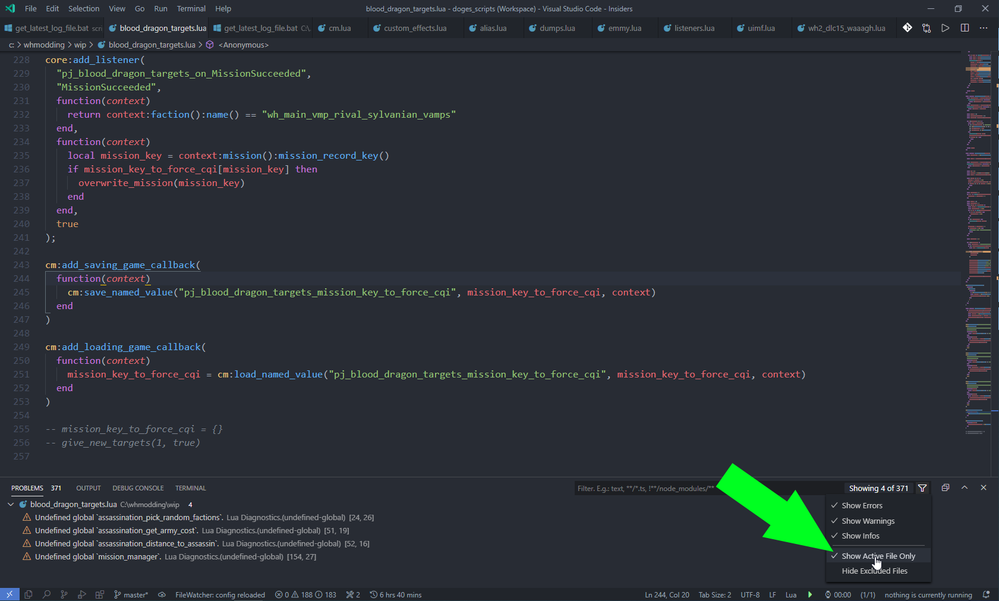

# Getting started with WH2 Lua scripting

## 1. Setting up your Lua coding environment

### 1.1. Get Visual Studio Code

<https://code.visualstudio.com/download>

### 1.2. Get the Lua extension by sumneko

<https://marketplace.visualstudio.com/items?itemName=sumneko.lua>

### 1.3. Download my Warhammer-Mods repo and extract it

<https://github.com/Shazbot/Warhammer-Mods/archive/master.zip>


### 1.4. Add the autocomplete folder from my repo to your workspace


### 1.5. In the problems panel enable "Show Active File Only"

Switch to the problems tab in the panel on the bottom.


The autocomplete folder will have errors that don't matter to us since the autocomplete files are just references. Enabling "Show Active File Only" is the simplest way to prevent error spam.



### 1.6. As long as you code inside this workspace you'll get autocomplete


## 2. Onward to a better workflow

Now you have a coding environment that will warn you when you have errors and help you with autocomplete. You are free to leave, but if you'd like, I'll introduce a better workflow to coding Lua mods using my Execute External Lua File mod.

### 2.1. Mods we need from the workshop

Subscribe to the following mods and enable them in the WH2 mod manager:

[Execute External Lua File](https://steamcommunity.com/sharedfiles/filedetails/?id=1916572654) - we'll use this to execute our code

[Script Debug Activator](https://steamcommunity.com/sharedfiles/filedetails/?id=1271877744) - this will enable the logging for your game, logs get saved into your Steam WH2 folder

[Draw Debug Logs](https://steamcommunity.com/sharedfiles/filedetails/?id=1929093751) - useful for visual debugging of Lua data, will show us errors in our code we execute

### 2.2. Create _exec.lua_

Go to File->New File in VSCode.
Inside the file write the following:

```lua
dout(cm:get_local_faction())
```

Now save the file as _exec.lua_, inside your _steamapps\common\Total War WARHAMMER II_ folder.

### 2.3. Execute our _exec.lua_ file

Go ingame and press F9, this will run our Lua file.
_dout_ is a function from the Draw Debug Logs mod, it will print out a string on the screen. We'll see the key of the faction we're playing printed on the screen.

### 2.4. The motivation

What we're trying to avoid is having to restart the game when making code changes. We can't learn or be productive if we don't have an environment that is conductive to that, and the exec.lua file will provide just that.
We'll have to make changes to our code when we're packaging the mod for the users, but more on that later.

### 2.5. How script executing works

Each time we press F9 our code gets run inside the game.
But any changes we made in previous executions remain.

```lua
local a = 5
dout(a)
```

This for example won't leave any side effects since `a` is a local variable, it's scope is our file.
If we make our file this instead and run it:

```lua
dout(a)
```

we'll get `nil` since `a` doesn't exist anymore, since it was local.

But if we declare `a` as a global variable:

```lua
a = 5
dout(a)
```

and then run:

```lua
dout(a)
```

it actually stays in the game memory as `a`.

The big ramification of this are listeners.

The following listener will print the name of the region (settlement, city) each time we select a region.

```lua
core:add_listener(
 "pj_settlement_listener",
 "SettlementSelected",
 true,
 function(context)
  local garrison = context:garrison_residence()
  dout(garrison:region():name())
 end,
 true
)
```

But if we execute this multiple times each time a new listener gets created, and the old listeners remain active.

To avoid this before every listener use `core:remove_listener`:

```lua
core:remove_listener("pj_settlement_listener")
core:add_listener(
 "pj_settlement_listener",
 "SettlementSelected",
 true,
 function(context)
  local garrison = context:garrison_residence()
  dout(garrison:region():name())
 end,
 true
)
```

Now before a listener is created, any listeners that exist with the id `pj_settlement_listener` will get removed.

### 2.6. Learning Lua and the WH2 Lua API

This isn't a tutorial on Lua. Vandy made a great tutorial for that:
[Lua Tutorials](https://tw-modding.com/docs/lua-tutorials/).

If you're new to programming I suggest you go over the [Codecademy JavaScript tutorial](https://www.codecademy.com/learn/introduction-to-javascript), most of the core concepts carry over between all programming languages.

After that you'll need the CA documentation on the Lua API we'll be using to manipulate the game. You'll mostly be using the the Campaign Manager (what `cm` actually stands for):

[Campaign Manager](https://chadvandy.github.io/tw_modding_resources/campaign/campaign_manager.html)

[More Campaign Manager](https://chadvandy.github.io/tw_modding_resources/campaign/episodic_scripting.html#class:episodic_scripting)

### 2.7. The timing differences

We run our code manually and then it exists in the game. But when we put our code in a pack we need to tell the game when to run it.
We usually want it to get run inside `cm:add_first_tick_callback`:

```lua
cm:add_first_tick_callback(
 function()
  dout("Hello World!")
 end
)
```

This makes the code inside the anonymous `function` run after the game world is created.
Also note that we can't actually test `add_first_tick_callback` using `exec.lua` since by the time we can press F9 it's already too late, the first tick is over and won't happen again. If we load the game the Lua environment gets reset and nothing of our `exec.lua` changes remains.
This also happens after battles, the campaign portion of the game after a battle gets created from scratch.

### 2.8. Conclusion

This can be very complex to grasp if you're not familiar with Lua or other programming languages. And if it was too complex (in no part due to my fault) I hope you do come back to this file at a later date, since I truly believe this is the only way to script in this game and stay sane.
